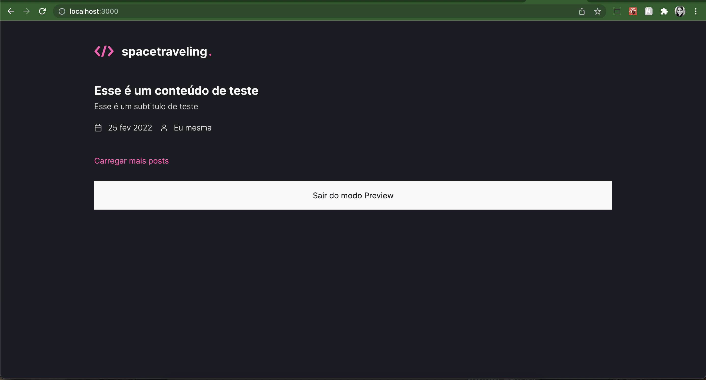
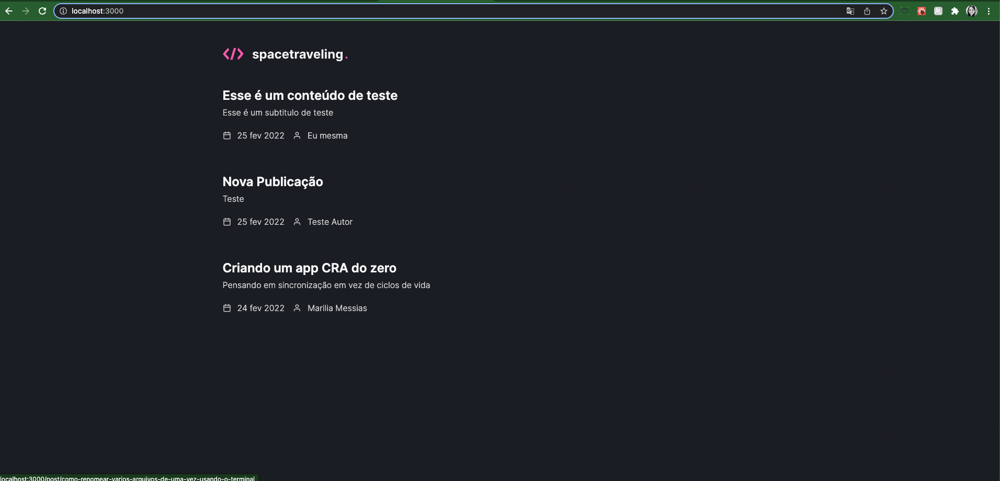
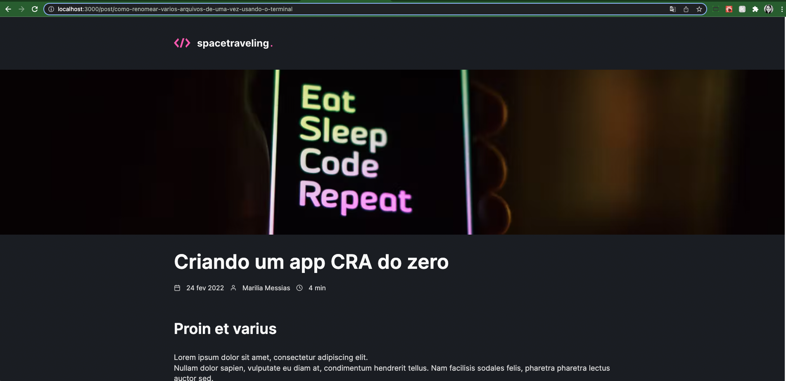
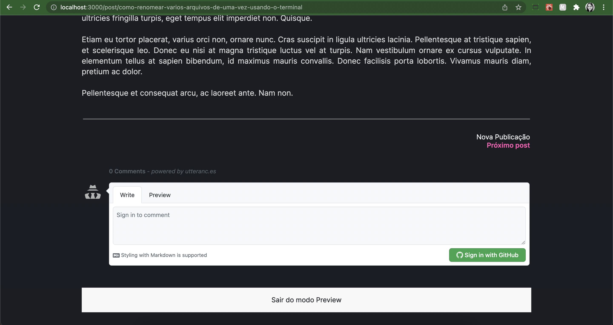
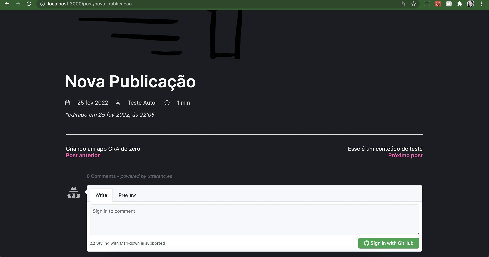
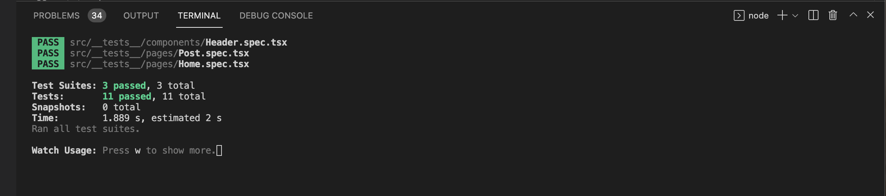

## 🧪 Tecnologias

Esse projeto foi desenvolvido com as seguintes tecnologias:

- [NextJs](https://nextjs.org/)
- [Prismic](https://prismic.io/)

## 🧪 Telas

Home. Na primeira imagem é possível ver o conceito de paginação, onde temos uma opção "carregar mais posts" que permanecerá habilitada até que não existam mais posts a serem exibidos. Na segunda imagem temos um exemplo de exibição no modo preview desta mesma página.

<h1 align="center">
    
</h1>
<h1 align="center">
    
</h1>
Lista com todos os posts cadastrados no prismic. Na primeira imagem é possível ver que o botão "carregar mais posts" não é mais exibido.
<br>
<h1 align="center">
    
</h1>
Página com as informações detalhadas sobre o post selecionado na tela anterior. Na primeira imagem, existe a primeira versão onde estão as informações carregadas do prismic. Na segunda e terceira, vemos a implementação dos comentários e a nova funcionalidade de ir para o próximo ou para o post anterior. Além disso, essa página também possui o recurso de preview.
<br>
<h1 align="center">
    
</h1>
<h1 align="center">
    
</h1>
<h1 align="center">
    
</h1>
Nessa aplicação existem testes e podemos ver que todos eles passaram, garantindo assim a integridade do que seria esperado na execução do projeto:
<br>
<h1 align="center">
    
</h1>

## 🚀 Como executar

Clone o projeto e acesse a pasta do mesmo.

```bash
$ git clone https://github.com/mariliamessias/ignite-spacetraveling/
$ cd ignite-spacetraveling
```

Para iniciá-lo, siga os passos abaixo:
```bash
# Instalar as dependências
$ yarn

# Iniciar o projeto
$ yarn start
```
O app estará disponível no seu browser pelo endereço http://localhost:3000.

## 💻 Projeto

Projeto do curso Ignite da Rocketseat que tem como objetivo 
criar um blog do zero, e fazer com que ele consuma dados do Prismic utilizando a tecnologia NextJs e ReactJs.

## 📝 License

Esse projeto está sob a licença MIT. Veja o arquivo [LICENSE](LICENSE.md) para mais detalhes.
